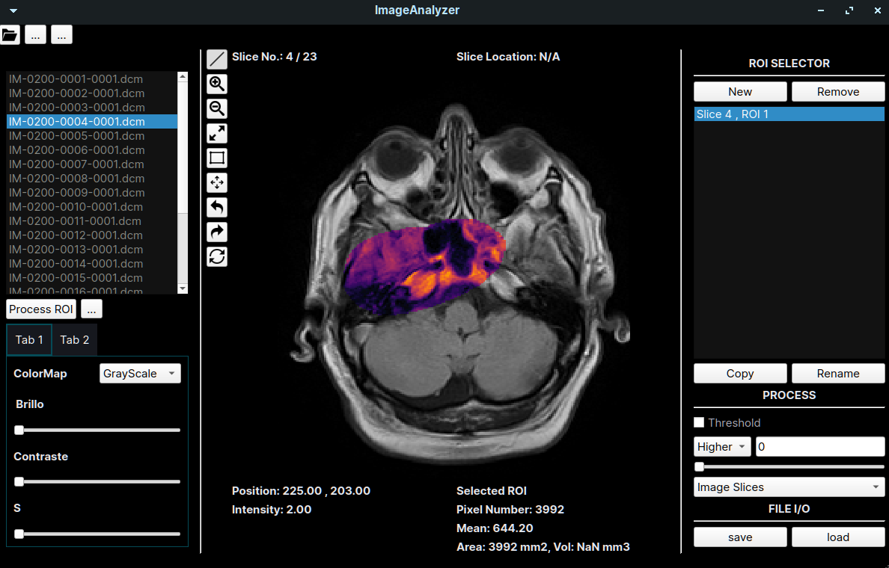
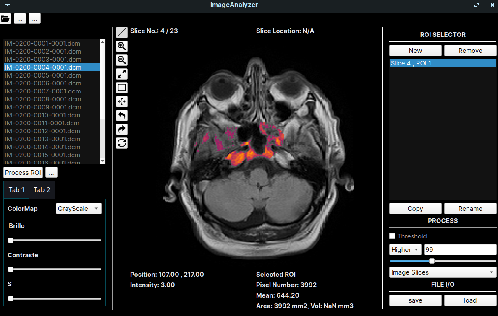

# Image Analyzer 
This a tool for process medical images. 

## Functionalities
- It can read dicom images sets.
- It allows to choose a ROI drawing over the image.
- It allows to form multiple ROIs in different images of a set. 
- It allows apply ROI treshold.

## Dependencies:
- pip install PyQt5
- pip install pydicom
- pip install opencv-python

